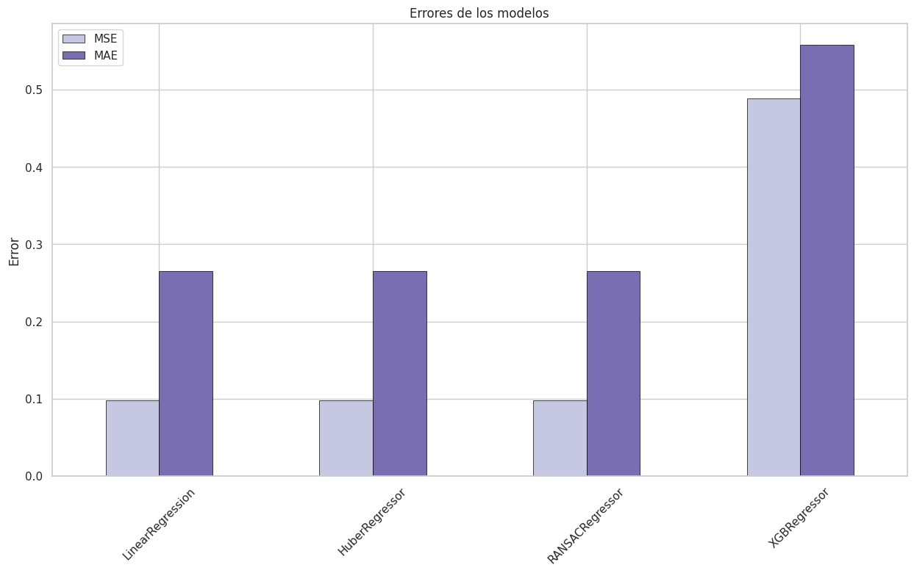
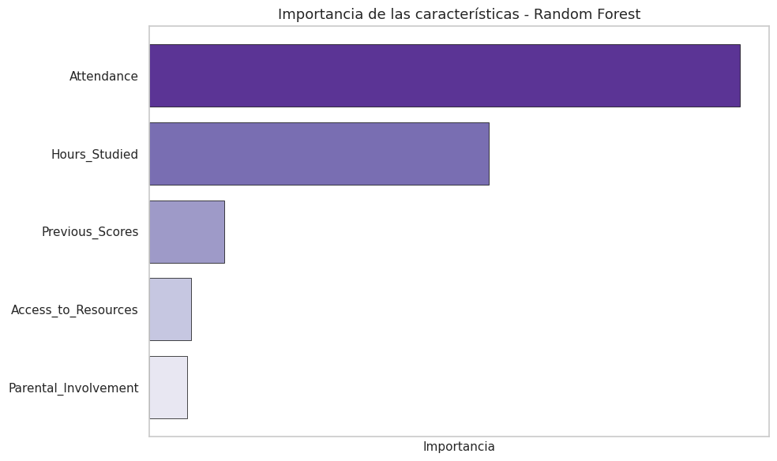

# Predicción del rendimiento académico 📚


## Descripción del Proyecto 🎯

El objetivo de este proyecto es predecir el rendimiento académico de una muestra de alumnos utilizando modelos de **machine learning**. A través de un análisis exhaustivo de los datos, se busca identificar los factores que más influyen en el rendimiento de los estudiantes y construir modelos predictivos precisos.

## Tecnologías Utilizadas 🛠️

Este proyecto está desarrollado en **Python** y utiliza las siguientes librerías principales:

- **Pandas**: Para la manipulación y análisis de datos.
- **NumPy**: Para operaciones numéricas avanzadas.
- **Matplotlib**: Para la visualización de datos.
- **Scikit-learn**: Para la implementación de modelos de machine learning.
- **Sweetviz**: Para el análisis exploratorio de datos (EDA) de manera rápida y eficiente.

## Instalación 🚀

Para ejecutar este proyecto, solo necesitas tener instaladas las librerías mencionadas anteriormente. Puedes instalarlas utilizando `pip`:

```bash
pip install pandas numpy matplotlib scikit-learn sweetviz
```

## Uso 💻

El proyecto está contenido en un **Jupyter Notebook** (`StudentPerformance.ipynb`). Para ejecutarlo, simplemente abre el notebook en cualquier entorno que soporte Jupyter (como JupyterLab, Google Colab, o VS Code) y ejecuta las celdas en orden.

## Estructura del Proyecto 📂

El proyecto tiene la siguiente estructura:

```
Rendimiento-Academico/
│
├── data/
│   └── StudentPerformanceFactors.csv  # Archivo de datos
│
└── StudentPerformance.ipynb           # Notebook principal
```

## Resultados 📊

Los modelos implementados han logrado errores absolutos menores a **0.5** en promedio, lo que indica una alta precisión en las predicciones. A continuación, se muestra una gráfica de los errores obtenidos:



Además, se obtuvo el siguiente orden de impmortancia de las variables:



## Contacto

Si tienes alguna pregunta o sugerencia, no dudes en contactarnos a través de LinkedIn:

Armando
[](www.linkedin.com/in/armando-islas)

Daniela
[](www.linkedin.com/in/dfloresq)

---

¡Gracias por visitar este proyecto! Esperamos que sea útil e interesante. 